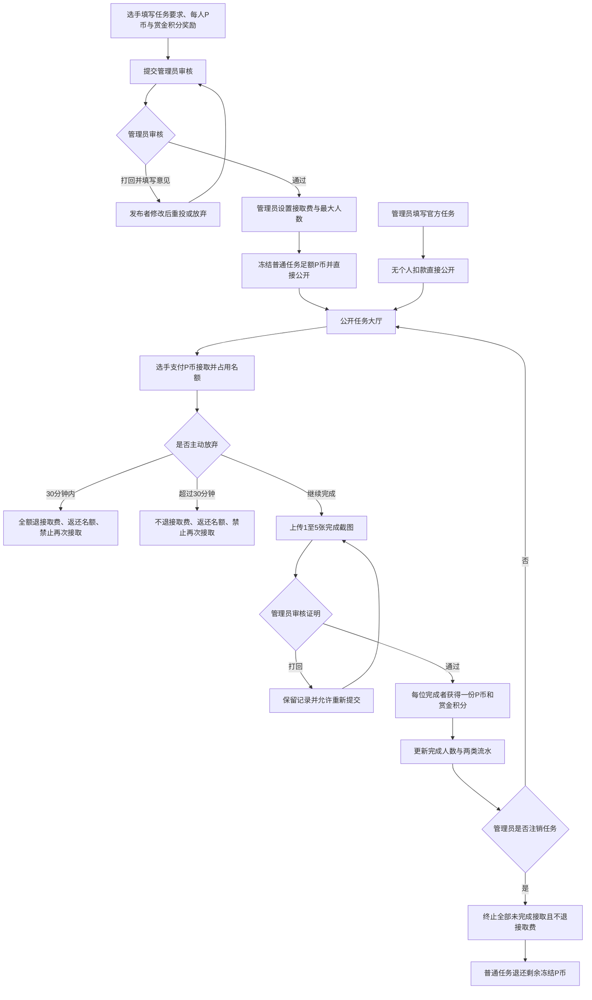

# 赛事任务系统开发设计

日期：2026-09-20
状态：已确认，作为本次开发与验收依据

## 1. 目标

为 LTL 站点增加赛事任务系统。已登录选手可以提交任务并选择匿名公开，管理员审核通过后公开；选手支付个人 P 币接取任务并上传截图证明，管理员审核完成后自动发放个人 P 币和赏金积分奖励。

赏金积分是独立的新型赛季积分，只用于赛季末排名，不可兑换、消费、转赠或提现。

本赛季任务与战队无关。任务发布者只能是个人选手，或通过管理员官方接口发布的官方任务。

### 总流程图

## 2. 名词与资金口径

- **个人 P 币**：使用 `players.deposit`，接取费用、普通任务悬赏冻结、奖励发放和剩余退款都必须写入个人 P 币流水。
- **赏金积分**：使用 `players.bounty` 作为当前赛季缓存余额，另建赏金积分流水保存赛季历史。
- **普通任务**：由某个选手发布。每位完成者获得一份 P 币奖励和一份赏金积分；管理员审核发布时冻结足以覆盖全部可接取名额的 P 币。
- **官方任务**：由管理员专用接口直接发布，不扣管理员个人 P 币；P 币奖励来源标记为系统，赏金积分同样由系统发放。
- **最大预算备注**：只作为文字提示，不参与校验或公式计算。
- **接取费用**：接取时从选手个人 P 币扣除并计入联盟资产；符合无损放弃规则时同步冲销。
- **匿名发布费**：普通任务选择匿名时，在审核通过发布时额外收取 `max(50P, 每人P币奖励 × 最大接取人数 × 后台费率)`；百分比金额向上取整，默认费率 10%，收取后不退。

## 3. 权限

- 未登录用户：只能查看公开任务。
- 已登录选手：发布普通任务、查看自己的发布记录、接取任务、放弃接取、提交完成证明。
- 管理员：审核任务发布、发布官方任务、审核证明、注销任务、查看全部记录。
- 发布者不能接取自己的任务。
- 所有管理接口必须由后端重新读取当前选手并校验管理员角色位，不能只依赖前端隐藏入口或 Cookie 中的角色值。

## 4. 任务发布流程

### 4.1 普通任务

1. 发布者填写标题、任务要求、每位完成者的 P 币奖励、每位完成者的赏金积分、备注，并可勾选匿名发布。
2. 提交后状态为 `PENDING_REVIEW`，不公开、不扣款。
3. 管理员可以：
   - 打回：必须填写修改意见，状态变为 `RETURNED`。
   - 通过：设置接取费用和最大接取人数。
4. 审核通过操作在同一事务内：
   - 锁定任务和发布者账户；
   - 校验发布者余额；匿名任务需同时覆盖冻结悬赏和匿名发布费；
   - 冻结 `每人P币奖励 × 最大接取人数`；
   - 写入 `task_reward_escrow` 个人 P 币流水；
   - 匿名任务另写入 `task_anonymous_fee` 个人 P 币与联盟资产流水，并保存发布时费率和金额快照；
   - 任务状态直接变为 `PUBLISHED`。
5. 余额不足时整笔事务失败，任务继续保持待审核状态，管理员可以调整人数或打回。
6. 被打回的发布者可以修改后重新投送，或标记为 `ABANDONED`。
7. 匿名只影响公开展示和公开接口：公开端返回“匿名发布者”且不返回发布者 ID；发布者本人和管理后台始终可见实名，后台在姓名后标注“（匿名）”。

### 4.2 官方任务

- 预留管理员专用发布接口。
- 服务端校验管理员身份后直接创建 `PUBLISHED` 任务。
- `official=1`、`publisher_player_id` 记录实际操作管理员，但不冻结或扣除管理员个人 P 币。
- 官方任务奖励发放时写入 `official_task_reward` 流水。

## 5. 接取与放弃

### 5.1 接取

公开任务页展示：任务要求、两类每人奖励、接取费用、已接取人数、剩余人数、发布时间、任务状态，以及下列规则：

> 接取后 30 分钟内主动放弃，全额退还接取费用；超过 30 分钟放弃不退还费用。无论是否退款，主动放弃都会返还任务名额。任务被管理员注销时，未完成接取者的费用不予返还。

接取事务必须锁定任务和选手，并校验：

- 任务状态为 `PUBLISHED`；
- 仍有名额；
- 当前选手不是发布者；
- 当前选手没有接取过该任务，包括历史已放弃记录；
- 个人 P 币足够支付接取费用。

成功后扣费、写入 `task_claim_fee` 流水、增加联盟资产流水、创建接取记录并占用名额。

### 5.2 主动放弃

- 未完成的接取可以主动放弃；正在等待管理员审核的证明随接取一起作废。
- 以服务器时间判断：`当前时间 <= claimed_at + 30分钟` 时全额退费，超过则不退。
- 无论是否退费，名额均返还。
- 同一选手放弃后不能再次接取同一任务，防止反复占位。
- 已完成或已被任务注销终止的接取不能主动放弃。

## 6. 完成证明与奖励

- 接取者可以提交说明和 1 至 5 张 JPG、PNG 或 WebP 截图。
- 单文件不超过 10MB，单次请求不超过 20MB。
- 每次重新提交建立新的证明批次，保留全部审核历史。
- 管理员打回证明时必须填写原因；任务仍有效时可重新提交。
- 管理员通过时在同一事务内：
  - 锁定任务、接取记录和获奖选手；
  - 确认尚未发奖；
  - 普通任务从冻结金额中核销并发放 P 币；官方任务由系统发放 P 币；
  - 增加当前赛季赏金积分；
  - 写入 P 币流水和赏金积分流水；
  - 接取状态变为 `COMPLETED`。
- 任务接取记录和奖励流水建立唯一关联，防止重复点击或请求重试造成重复发奖。

## 7. 注销

- 管理员确认任务完成情况达到要求后可以注销任务。
- 注销前显示未完成接取人数、待审证明数量和剩余冻结 P 币。
- 注销事务锁定任务及相关接取记录：
  - 任务变为 `CLOSED`，不再公开接取；
  - 所有未完成接取变为 `TERMINATED`；
  - 待审证明同步作废；
  - 接取费用不返还；
  - 普通任务剩余冻结 P 币退还发布者，并写入 `task_reward_escrow_refund` 流水；
  - 官方任务不存在个人退款；
  - 已完成记录和已发奖励保持不变。

## 8. 状态

任务状态：

- `PENDING_REVIEW`
- `RETURNED`
- `PUBLISHED`
- `CLOSED`
- `ABANDONED`

接取状态：

- `CLAIMED`
- `PROOF_PENDING`
- `PROOF_RETURNED`
- `COMPLETED`
- `COMPLETION_REVOKED`
- `ABANDONED`
- `TERMINATED`

证明状态：

- `PENDING`
- `RETURNED`
- `APPROVED`
- `REVOKED`
- `VOIDED`

## 9. 数据结构

- `event_tasks`：任务内容、赛季、发布者、匿名标记、匿名费率/金额快照、奖励、接取费、名额、冻结/发放/退款金额、状态和审核信息。
- `event_task_reviews`：任务发布审核历史。
- `event_task_claims`：接取、费用快照、奖励快照、状态和时间；`task_id + player_id` 唯一。
- `event_task_proofs`：每次证明提交及审核结果。
- `event_task_proof_images`：证明截图。
- `player_bounty_ledger`：赏金积分流水，含赛季、任务、接取和证明引用；任务奖励对 `claim_id` 唯一。
- `player_deposit_ledger` 增加通用引用字段 `ref_table`、`ref_id`，用于追踪任务资金。

## 10. 页面与接口

页面：

- `event-tasks.html`：公开任务中心、任务详情、发布任务、我的发布、我的接取。
- `admin-event-tasks.html`：待审核任务、待审证明、进行中任务、完成历史及已注销任务。

主要接口：

- 公开/选手：`GET /event-tasks/settings`、`GET /event-tasks`、`GET /event-tasks/{id}`、`POST /event-tasks`、`PUT /event-tasks/{id}`、`POST /event-tasks/{id}/resubmit`、`POST /event-tasks/{id}/abandon-publication`、`POST /event-tasks/{id}/claims`、`POST /event-task-claims/{id}/abandon`、`POST /event-task-claims/{id}/proofs`。
- 管理员：`GET /admin/event-tasks`、`POST /admin/event-tasks/{id}/return`、`POST /admin/event-tasks/{id}/publish`、`POST /admin/event-tasks/official`、`POST /admin/event-task-proofs/{id}/return`、`POST /admin/event-task-proofs/{id}/approve`、`POST /admin/event-task-claims/{id}/revoke-completion`、`POST /admin/event-tasks/{id}/close`。

## 11. 并发与幂等

- 最后名额：锁定任务行后重新统计占用名额，防止超卖。
- 接取扣费：锁定选手行，扣费和接取记录在同一事务。
- 放弃与证明审核：锁定同一接取记录，先提交成功的事务决定最终状态。
- 注销与上传/审核：所有操作重新检查锁定后的任务状态。
- 重复发奖：接取状态检查、唯一流水约束和同一事务三层防护。
- 撤回完成：任务、接取和选手依次加锁；状态门禁和反向唯一流水阻止重复扣回。撤回仅允许进行中的任务，保证返还的接取名额立即可用。
- 金额乘法使用 `Math.multiplyExact`，溢出返回业务错误。
- 匿名费与悬赏冻结合计使用溢出校验；费率只允许后台配置为 0% 至 100%，每个已发布任务保留实际费率快照。

## 12. 验收重点

- 普通任务审核发布、余额不足失败、打回重投和放弃。
- 匿名任务公开端不泄露姓名或发布者 ID，后台显示实名与匿名标记；验证 50P 最低收费、百分比收费、向上取整和余额不足回滚。
- 官方任务无个人扣款且只能由管理员发布。
- 最后一个名额并发时只成功一次。
- 30 分钟边界内退款、边界外不退款，两种情况均返还名额。
- 发布者不能接取自己的任务，放弃者不能再次接取。
- 证明打回重投、审核通过双奖励到账、重复审核不重复发奖。
- 完成历史可追溯；撤回完成时扣回P币和赏金积分、恢复普通任务冻结奖励、返还一个接取名额，接取费不退。选手已消费奖励时允许余额变为负数以保证账目守恒。
- 注销终止未完成接取、接取费不退、剩余冻结金额退回。
- 赏金积分只计入当前赛季流水和排名，不提供任何消费或转移接口。

## 13. 部署步骤

1. 备份生产数据库，并确认应用当前使用的数据库名称。
2. 首次安装先执行一次 `backend/src/main/resources/db/migration_event_tasks.sql`；已安装赛事任务系统的环境不要重复执行。
3. 执行一次增量迁移 `backend/src/main/resources/db/migration_event_task_anonymous.sql`，增加匿名字段和默认费率参数。
4. 部署后端和前端资源，确认后端上传根目录可写；证明截图会保存到现有上传目录下的 `tasks/` 子目录。
5. 重启后检查公开任务页、管理任务页、规则参数页和资产总览，完成匿名与非匿名任务的发布审核冒烟验证。
6. 生产验证通过前不要对外开放入口；如迁移或启动失败，使用数据库和应用备份回滚。
