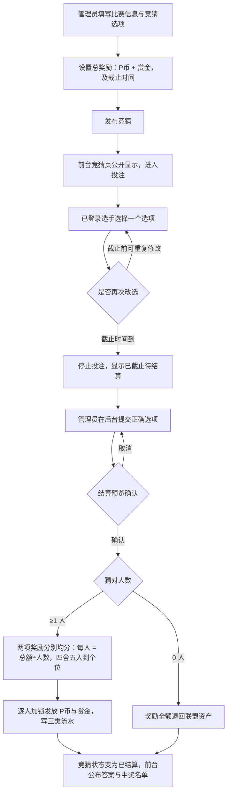

# 比赛竞猜系统开发设计

日期：2026-10-01
状态：待确认（确认后作为开发与验收依据）

## 1. 目标

为 LTL 站点增加比赛竞猜系统。管理员发布竞猜题目（比赛信息 + 若干竞猜选项），设置总奖励（个人 P 币与赏金积分两项）和截止时间；选手在截止前选择一个选项参与竞猜；比赛结束后管理员提交正确选项，系统自动将两项总奖励分别平均分配给竞猜正确的选手（四舍五入到个位），随后竞猜结束。

参与竞猜**不收取任何费用**。总奖励由联盟资产承担。

### 总流程图



## 2. 名词与资金口径

- **个人 P 币**：使用 `players.deposit` 余额；奖励发放写 `player_deposit_ledger` 流水，type=`prediction_reward`，`ref_table='match_prediction_bets'`、`ref_id=投注记录ID`，利用现有唯一键 `uk_player_deposit_business_flow` 保证不重复发奖。
- **赏金积分**：使用 `players.bounty` 余额；发放写 `player_bounty_ledger` 流水（同 event_task 的 `task_reward` 模式），type=`prediction_reward`。迁移中为该表补充通用引用列 `ref_table`/`ref_id`。
- **总奖励**：管理员设置的两项总额（P 币总额、赏金总额），发布后不可修改。
- **均分规则**：每人所得 = `四舍五入(总额 ÷ 猜对人数)` 到个位，两项分别计算。实发合计与总额的差额（因舍入产生，每人最多 ±0.5×人数）写回联盟资产，保证账目守恒。
- **联盟资产**：奖励支出写 `league_asset_ledger` 负向流水（与现有联盟资产口径一致，实现时对齐 `LeagueAssetLedger` 实体列）；无人猜中或作废时全额退回。
- **竞猜选项**：2~6 条自由文本（如"WE 胜""TES 胜""2:1 WE"），发布后锁定不可修改。

## 3. 权限

- 未登录用户：只能浏览竞猜列表与详情，不能投注。
- 已登录选手：参与竞猜、截止前修改自己的选择、查看自己的投注与中奖记录。
- 管理员：发布/编辑竞猜、提交正确选项结算、作废竞猜、查看全部投注明细。
- 管理接口一律后端 `requireAdmin(token)` 校验角色位，不依赖前端隐藏入口。

## 4. 发布（管理员）

1. 填写：竞猜标题（可自动带出关联比赛的对阵信息）、说明（可选）、关联比赛（可选，从 `matches` 选择未结束场次）、竞猜选项 2~6 条、总奖励（P 币、赏金，均须 ≥1）、截止时间（须晚于当前）。
2. 提交即发布，状态 `PUBLISHED`，立即在前台可见可投注（无审核环节）。
3. 已有人投注后，仅允许**延长截止时间**和修改标题/说明；选项与奖励锁定。
4. 截止时间到达不做任何自动状态变更，投注接口按 `now > deadline_at` 拒绝；前台按同一规则展示"已截止待结算"。

## 5. 投注（选手）

- 每场竞猜每人一票：`match_prediction_bets` 上 `UNIQUE(prediction_id, player_id)`。
- 截止前可反复改选：直接更新该行的 `option_id`（覆盖式，保留 `updated_at`；如需审计轨迹后续加日志表）。
- **截止前隐藏票数分布**，仅显示总参与人数，防止跟风；结算后在详情中公布各选项票数与占比。
- 投注、改票、浏览均不产生任何扣费与流水。

## 6. 结算（管理员）

1. 管理员在后台选择正确选项 → 系统先返回**结算预览**（猜对人数、每位中奖人、每人两项所得、差额退回金额），管理员确认后才真正执行。
2. 结算前置校验：竞猜为 `PUBLISHED` 且当前时间已过截止时间；未过截止时间不允许结算（避免还有人想投）。
3. 结算事务（`@Transactional`，锁竞猜行）：
   - 重新校验状态与截止，防止并发重复结算；
   - 统计正确选项的有效投注；
   - **0 人猜中**：不发放，奖励总额写联盟资产退回流水，状态 `SETTLED`，前台显示"无人猜中"；
   - **≥1 人猜中**：`pShare = round(rewardP ÷ n)`、`bShare = round(rewardBounty ÷ n)`（HALF_UP）；逐个 `selectByIdForUpdate` 锁定中奖选手，加余额、写个人 P 币流水与赏金流水；差额 `(total − share×n)` 两项分别写联盟资产退回流水；记录 `winner_count` 与两项 `per_winner` 快照；状态 `SETTLED`。
4. 作废：任何时间可作废（比赛取消等），状态 `CANCELLED`，不发放任何奖励，总额退回联盟资产；须填写原因。
5. 结算与作废均不可逆；结算后前台公布答案、票数分布与中奖名单。

## 7. 状态

竞猜状态：

- `PUBLISHED`：投注中（含已截止待结算的展示态，由 deadline 推导，不落库）
- `SETTLED`：已结算
- `CANCELLED`：已作废

## 8. 数据结构

新表三张 + 两张存量表小幅迁移，脚本 `backend/src/main/resources/db/migration_match_predictions.sql`（手动执行一次，执行前备份）：

- `match_predictions`：`id`、`season`、`match_id`(nullable, FK→matches)、`title`、`description`、`reward_p_total`、`reward_bounty_total`、`deadline_at`、`status`、`correct_option_id`(nullable)、`winner_count`、`reward_p_per_winner`、`reward_bounty_per_winner`、`settled_at`、`settled_by_player_id`、`cancel_reason`、`cancelled_at`、`created_by_player_id`、`createdAt/updatedAt/deleted`。
- `match_prediction_options`：`id`、`prediction_id`(FK)、`label`、`sort_order`、`createdAt/deleted`。
- `match_prediction_bets`：`id`、`prediction_id`(FK)、`option_id`(FK)、`player_id`(FK→players)、`created_at`、`updated_at`、`deleted`；`UNIQUE(prediction_id, player_id)`。
- `player_bounty_ledger` 增加 `ref_table`/`ref_id` 通用引用列（对齐个人 P 币流水的做法）。
- `league_asset_ledger` 如缺少通用类型列则在迁移中确认兼容 `prediction_reward`/`prediction_reward_refund` 类型。

实体：`Prediction`、`PredictionOption`、`PredictionBet`（MyBatis-Plus + Lombok，模式同 `EventTask*`）。

## 9. 页面与接口

页面：

- `predictions.html` + `src/predictions.js`：前台竞猜页（进行中 / 已结束Tab、投注、改票、中奖名单）。
- `admin-predictions.html` + `src/admin/predictions.js`：后台竞猜管理（发布表单、管理列表、结算、作废）。

导航注册：`src/components/public-nav.js` 的 `baseNavItems` 增加"比赛竞猜"；`src/components/admin-nav.js` 的"赛事运营"组增加"竞猜管理"。

主要接口（Context path `/api`，认证均走 `ltl_auth` Cookie）：

- 选手/公开：`GET /predictions`（进行中+已结束，登录则附 myBet）、`GET /predictions/{id}`（详情；结算后含票数分布与中奖名单）、`POST /predictions/{id}/bets` `{optionId}`（投注或改票）。
- 管理员：`GET /admin/predictions?status=`、`POST /admin/predictions`、`PUT /admin/predictions/{id}`、`GET /admin/predictions/{id}/settle-preview?correctOptionId=`、`POST /admin/predictions/{id}/settle` `{correctOptionId}`、`POST /admin/predictions/{id}/cancel` `{reason}`。

## 10. 页面示意图

### 10.1 前台竞猜页（predictions.html）— 进行中的竞猜

```
┌─ LTL 职业联赛  [首页] [公告] [战队榜] [赛程] [赛事任务] [比赛竞猜] …     P币: 1280 ─┐
│                                                                                  │
│  比赛竞猜                                      [进行中 (2)] [已结束 (5)]          │
│ ──────────────────────────────────────────────────────────────────────────────  │
│  ┌──────────────────────────────────────────────────────────────────────────┐   │
│  │ 🔥 第3轮 · 10月3日 20:00                                    ⏰ 截止 10-03 19:00 │   │
│  │    WE  vs  TES   （BO3）                                                   │   │
│  │    本场竞猜：比赛的最终比分是？                                               │   │
│  │                                                                            │   │
│  │    奖池： 🪙 P币 500        💰 赏金 300                                     │   │
│  │    已参与： 24 人（票数分布将在截止后公布）                                    │   │
│  │                                                                            │   │
│  │    ┌──────────────┐ ┌──────────────┐ ┌──────────────┐                      │   │
│  │    │   WE 2:0     │ │   WE 2:1     │ │   TES 2:0     │                      │   │
│  │    └──────────────┘ └──────────────┘ └──────────────┘                      │   │
│  │    ┌──────────────┐                                                          │   │
│  │    │   TES 2:1    │           ✅ 已选： WE 2:1   [修改选择]（截止前可改）      │   │
│  │    └──────────────┘                                                          │   │
│  └──────────────────────────────────────────────────────────────────────────┘   │
│  ┌──────────────────────────────────────────────────────────────────────────┐   │
│  │    赛季竞猜：本赛季总冠军是哪支战队？                        ⏰ 截止 10-20 23:59│   │
│  │    …（未关联比赛的自由竞猜，同一套卡片）                                       │   │
│  └──────────────────────────────────────────────────────────────────────────┘   │
└──────────────────────────────────────────────────────────────────────────────────┘
```

要点：未登录点选项 → 跳登录；已选选项高亮，点其他选项即改票；倒计时实时刷新。

### 10.2 前台竞猜页 — 已结算的竞猜

```
│  ┌──────────────────────────────────────────────────────────────────────────┐   │
│  │ ✅ 第2轮 · 9月26日 20:00                          已结算 · 答案：WE 2:1    │   │
│  │    WE  vs  TES   （BO3）     比赛竞猜：最终比分是？                           │   │
│  │                                                                            │   │
│  │    ┌────────────┐ ┌────────────┐ ┌────────────┐ ┌────────────┐             │   │
│  │    │   WE 2:0   │ │ ✔ WE 2:1   │ │   TES 2:0  │ │   TES 2:1  │             │   │
│  │    │    8 票    │ │ 🎯 6 票    │ │    5 票    │ │    5 票    │             │   │
│  │    │   33.3%   │ │   25.0%    │ │   20.8%    │ │   20.8%    │             │   │
│  │    └────────────┘ └────────────┘ └────────────┘ └────────────┘             │   │
│  │                                                                            │   │
│  │    6 人猜对，每人获得： 🪙 P币 83（500÷6 四舍五入）  💰 赏金 50              │   │
│  │    中奖名单：玩家A、玩家B、玩家C …（我的选择：WE 2:1 ✅ 中奖 +83P +50赏金）   │   │
│  └──────────────────────────────────────────────────────────────────────────┘   │
```

### 10.3 后台竞猜管理（admin-predictions.html）— 发布表单

```
┌─ LTL 管理后台 ▾ ─────────────────────────────────────────────────────────────┐
│ 赛事运营                     │  竞猜管理 > 发布新竞猜                           │
│  ├ 赛程管理                  │ ───────────────────────────────────────────── │
│  ├ 赛果录入                  │  关联比赛（可选）  [ 选择比赛 ▾ ]                │
│  ├ 赛事任务                  │      └ 自动填充：第3轮 · WE vs TES · 10-03 20:00 │
│  ├ 竞猜管理  ←               │  竞猜标题 *      [ 本场比赛的最终比分是？______ ] │
│  ├ …                        │  说明            [ (可选) 支持加时赛比分 ______ ] │
│ 选手管理                     │  竞猜选项 *（2~6 个，发布后锁定）                  │
│  ├ …                        │    1. [ WE 2:0 ______ ]  [×]                     │
│ 资产与规则                   │    2. [ WE 2:1 ______ ]  [×]                     │
│  ├ …                        │    3. [ TES 2:0 ______ ]  [×]                    │
│                             │    4. [ TES 2:1 ______ ]  [×]                    │
│                             │    [+ 添加选项]                                  │
│                             │  总奖励 *         🪙 P币  [ 500  ]               │
│                             │                   💰 赏金 [ 300  ]               │
│                             │  截止时间 *       [ 2026-10-03 19:00 ▾ ]          │
│                             │                                                  │
│                             │             [ 保存草稿不需要 ]  [ 发布竞猜 ]       │
└──────────────────────────────────────────────────────────────────────────────┘
```

### 10.4 后台 — 竞猜管理列表（含已截止待结算）

```
│  竞猜管理                    │  [发布新竞猜]                                   │
│                             │ ───────────────────────────────────────────── │
│                             │  状态筛选：[全部] [投注中] [待结算] [已结算] [已作废]│
│                             │ ┌────────────────────────────────────────────┐ │
│                             │ │ 最终比分是？ WE vs TES                      │ │
│                             │ │ 奖池 500P/300赏金 · 24人投注 · 截止 10-03   │ │
│                             │ │ 状态：⏸ 已截止待结算                        │ │
│                             │ │              [结算] [作废]                  │ │
│                             │ ├────────────────────────────────────────────┤ │
│                             │ │ 第2轮比分竞猜 WE vs TES                     │ │
│                             │ │ 奖池 500P/300赏金 · 24人 · 答案 WE 2:1      │ │
│                             │ │ 状态：✅ 已结算 · 6人中奖 · 每人83P/50赏金   │ │
│                             │ │              [查看明细]                     │ │
│                             │ ├────────────────────────────────────────────┤ │
│                             │ │ 赛季冠军竞猜（进行中 · 截止 10-20）           │ │
│                             │ │              [延长截止] [结算] [作废]        │ │
│                             │ └────────────────────────────────────────────┘ │
```

### 10.5 后台 — 结算弹窗（先预览、后确认）

```
│        ┌─ 结算竞猜：最终比分是？ WE vs TES ──────────────────────────┐        │
│        │                                                            │        │
│        │  正确选项 *   ( ) WE 2:0   (•) WE 2:1   ( ) TES 2:0 …      │        │
│        │                                                            │        │
│        │  ── 结算预览（选择后实时计算） ────────────────────────────    │        │
│        │  猜对人数：6 人                                             │        │
│        │  每人获得：🪙 P币 83   💰 赏金 50                            │        │
│        │  中奖人：玩家A、玩家B、玩家C、玩家D、玩家E、玩家F              │        │
│        │  舍入差额退回联盟资产：🪙 2P   💰 0                          │        │
│        │                                                            │        │
│        │  ⚠️ 结算后不可撤销，奖励立即发放                              │        │
│        │                                                            │        │
│        │                    [取消]      [确认结算并发放]              │        │
│        └────────────────────────────────────────────────────────────┘        │
```

## 11. 并发与幂等

- 投注/改票：`UNIQUE(prediction_id, player_id)` 防重复插入；改票为 UPDATE 天然幂等。
- 结算：锁竞猜行 + 状态门禁（仅 `PUBLISHED` 可结算）防重复结算；事务内重读截止时间。
- 发奖：每人的发奖流水受 `uk_player_deposit_business_flow`（player + type + ref_table + ref_id）唯一约束保护，重试/重放不会重复入账。
- 结算时逐个锁定中奖选手行（`selectByIdForUpdate`），与 event_task 发奖同模式。
- 金额只涉及整数四则与 `Math.round`（HALF_UP），无溢出风险面。

## 12. 验收重点

- 发布校验：选项 2~6 个、奖励 ≥1、截止时间晚于当前；有人投注后选项/奖励不可改，只能延长截止。
- 未登录不能投注；一人一票；截止前改票生效；截止后接口拒绝并提示。
- 截止前前台不泄露任何选项票数分布。
- 结算：预览金额与实际发放一致；`500÷6=83.33→83`、`300÷6=50`；差额正确退回联盟资产；账目守恒（联盟支出 = 实发合计 + 差额退回）。
- 无人猜中：不发放，全额退回，前台显示"无人猜中"。
- 作废：不发奖、全额退回、必须填原因。
- 重复点击结算/请求重放只成功一次；结算后再投注被拒绝。
- 余额、`player_deposit_ledger`、`player_bounty_ledger`、`league_asset_ledger` 四处账实一致。

## 13. 部署步骤

1. 备份生产数据库。
2. 执行一次 `backend/src/main/resources/db/migration_match_predictions.sql`（建三张新表 + 两处存量表加列）。
3. 部署后端与前端，重启服务。
4. 冒烟：发布一场测试竞猜 → 双账号投注 → 结算 → 核对两名选手余额与三类流水 → 作废另一场验证退回。
5. 生产验证通过后再把导航入口放开（或直接发布，视运营需要）。
